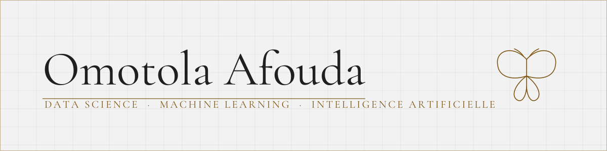

<picture>
  <source media="(prefers-color-scheme: dark)" srcset="banniere-sombre.svg">
  
</picture>

Mon prénom signifie « l'enfant a atteint la gloire ». Moi, j'y travaille encore.

Étudiante en 3ᵉ année de licence d'Intelligence Artificielle à Cotonou, je
construis des modèles qui regardent des choses réelles : des carrefours
saturés, des récoltes, des clients sur le point de partir. Ce que je préfère
dans ce travail, c'est le moment où un tableau de chiffres bruts commence à
répondre.

**Je cherche un stage en data science ou en machine learning.**

[Mon portfolio](https://portfolio-omotola.vercel.app) ·
[LinkedIn](https://www.linkedin.com/in/omotola-afouda) ·
[andreaafouda@gmail.com](mailto:andreaafouda@gmail.com)

---

## Trois projets, et ce qu'ils m'ont appris

### [Détection de véhicules en trafic dense](https://github.com/Omotolaaa7/-traffic-vehicle-detection-yolov8)

Un YOLOv8 pré-entraîné voit très bien une voiture qui remplit l'image. Filmé
d'en haut, dans un embouteillage, il décroche. Ce projet mesure ce qu'un
fine-tuning change vraiment, et surtout ce qu'il change sur les petits objets.

| | Pré-entraîné | Après fine-tuning |
|---|---:|---:|
| mAP@0.5 | 0.438 | **0.825** |
| Rappel, petits véhicules | 0.122 | **0.694** |
| Rappel, véhicules moyens | 0.373 | 0.879 |
| Débit | 37.2 FPS | 43.2 FPS |

Le chiffre qui m'a servi de leçon est le 0.122. Le mAP global était bon, je
m'y suis arrêtée, et c'est en découpant par taille d'objet que j'ai vu que
neuf petits véhicules sur dix passaient à travers. Une moyenne peut être
bonne pendant qu'un modèle rate l'essentiel.

*Jeu de données BMD-45, environ 3 000 images. Les chiffres valent sur son jeu
de test, pas sur les routes béninoises : il n'existe pas de données locales
publiques, et le dire fait partie du protocole.*

### [ChurnClient](https://github.com/Omotolaaa7/ml_projet_ChurnClient)

Prédire quels clients vont partir avant qu'ils ne le décident eux-mêmes.
7 043 clients, une analyse exploratoire complète, un pipeline de bout en bout.

J'étais sûre de savoir qui partait. L'analyse a dit autre chose.

### [Rendements agricoles en Afrique de l'Ouest](https://github.com/Omotolaaa7/west_africa-crop_yield_prediction)

Maïs, riz, sorgho, mil. Une régression sur des données climatiques,
socio-économiques et agronomiques venues de sources différentes, avec des
unités et des granularités qui ne s'accordent pas. Le vrai travail était le
nettoyage, et personne ne le raconte jamais.

<b>Et aussi</b>

 

**[Répartition équitable de l'eau](https://github.com/Omotolaaa7/equitable-water-distribution)**
Répartir l'eau sur un réseau de distribution quand la demande est incertaine.
Optimisation quadratique par pénalisation, descente de gradient projetée,
validation par simulation Monte-Carlo.

**SkillZ, deuxième prix du hackathon HACKBYIFRI 2026**
Une place de marché de compétences étudiantes pensée pour le contexte
béninois : paiement MTN MoMo, Moov Money et Celtiis Cash, séquestre, notation
dans les deux sens, connexion par matricule universitaire. De l'idée au
prototype en 48 heures, en équipe.

**[Règles d'association](https://github.com/Omotolaaa7/recommandation_association_rules)** ·
**[Gestion de bibliothèque](https://github.com/Omotolaaa7/SGBibliotheque)** ·
**[Recommandation de films](https://github.com/Omotolaaa7/movie_recommender)** ·
**[HTML vers CSV](https://github.com/Omotolaaa7/HTML_to_CSV)**

Et [le reste](https://github.com/Omotolaaa7?tab=repositories), y compris les
petits exercices : ils font partie du chemin.

---

## Les outils

**Mon terrain quotidien**

**En cours d'apprentissage**

Chaque ligne est adossée à un dépôt qu'on peut ouvrir. Pas de barre de
pourcentage : « en cours » veut dire en cours.

---

## Vers où je vais

La data science d'abord, l'intelligence artificielle embarquée ensuite :
sortir les modèles des serveurs pour les installer dans les objets, au plus
près du monde.

Une Afrique technologique m'a fait rêver devant un écran. J'aimerais
contribuer à la rendre un peu moins fictive.

---

## En dehors du travail

**Les échecs.** Mon souvenir le plus net est une défaite : une partie qui
s'est effondrée et qui m'a plus appris que toutes mes victoires. Depuis, je
rejoue les coups et je cherche l'instant où tout a basculé, exactement comme
on débogue un modèle.

**Les histoires dessinées.** Vinland Saga plus que tout : voir Thorfinn se
perdre puis se reconstruire m'a convaincue qu'on peut toujours choisir qui
l'on devient.

**Le grand écran.** Marvel m'a donné le déclic, et Black Panther l'a rendu
inoubliable : ce jour-là, une Afrique technologique et fière a cessé d'être
une hypothèse.

**La musique.** Afro, rap, amapiano, pop, selon l'humeur du jour et la
résistance du bug. Sur les pires bugs, le bon morceau est parfois le silence.

---

> *« Si tu peux voir détruit l'ouvrage de ta vie, et sans dire un seul mot te
> mettre à rebâtir »*
>
> Rudyard Kipling, *Tu seras un homme, mon fils*, un poème que mon père m'a
> offert. Trois mots m'en sont restés, que je dois autant aux échecs :
> itérer, douter, recommencer. C'est le troisième qui coûte.

<b>English version</b>

 

My first name means « the child has attained glory ». I am still working on it.

I am a third-year Artificial Intelligence undergraduate in Cotonou, Benin. I
build models that look at real things: congested junctions, harvests,
customers about to leave. What I like most is the moment raw numbers start
answering back.

**I am looking for an internship in data science or machine learning.**

[Portfolio](https://portfolio-omotola.vercel.app) ·
[LinkedIn](https://www.linkedin.com/in/omotola-afouda) ·
[andreaafouda@gmail.com](mailto:andreaafouda@gmail.com)

**[Dense traffic vehicle detection](https://github.com/Omotolaaa7/-traffic-vehicle-detection-yolov8)**
A pre-trained YOLOv8 sees a car filling the frame very well. Shot from above,
in a traffic jam, it falls apart. mAP@0.5 went from 0.438 to 0.825, and recall
on small vehicles from 0.122 to 0.694. That 0.122 taught me the most: the
global mAP looked fine, I stopped there, and it was only by breaking results
down by object size that I saw nine small vehicles out of ten slipping
through. An average can look good while a model misses what matters.

**[ChurnClient](https://github.com/Omotolaaa7/ml_projet_ChurnClient)**
Predicting which customers will leave before they decide to. 7,043 customers,
a full exploratory analysis, an end-to-end pipeline. I was sure I knew who was
leaving. The analysis said otherwise.

**[West African crop yields](https://github.com/Omotolaaa7/west_africa-crop_yield_prediction)**
Maize, rice, sorghum, millet. A regression on climate, socio-economic and
agronomic data from different sources, with units and granularities that do
not agree. The real work was the cleaning, and nobody ever tells that part.

**[Fair water distribution](https://github.com/Omotolaaa7/equitable-water-distribution)**
Distributing water across a network under uncertain demand. Quadratic
optimisation by penalisation, projected gradient descent, Monte-Carlo
validation.

**SkillZ, second prize at the HACKBYIFRI 2026 hackathon**
A local marketplace for student skills, built for the Beninese context: MTN
MoMo, Moov Money and Celtiis Cash payments, escrow, two-way ratings, sign-in
by university student number. From idea to working prototype in 48 hours.

Day to day: Python, pandas, NumPy, scikit-learn, Matplotlib, Jupyter.
Learning: PyTorch, R, MySQL, Streamlit.

Data science first, embedded AI next: taking models out of servers and putting
them into objects, closer to the world. A technological Africa made me dream
in front of a screen. I would like to help make it a little less fictional.

